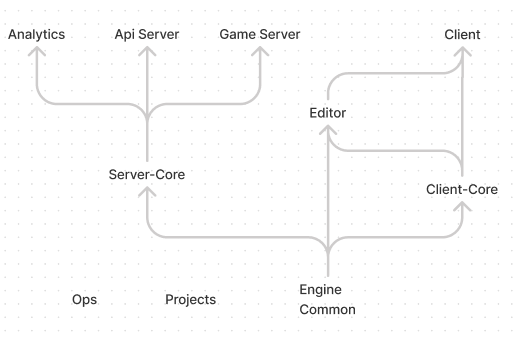

# Why are we building XREngine?

We chose to build a free, open, full-stack MMO engine that anyone could run for 
any reason - to host events, make games, show art, or just to give a space for 
your community. There are plenty of platforms you can spend a bit of money on to 
have a world, but you can't be in complete control of the experience or 
customise it from the ground up.

When the XREngine stack is deployed, that stack is sovereign, open and cross 
platform by default. Users can make any kind of game or experience with no limits. 
And with the tech we're building now, users will be able to seamlessly travel 
through portals from my worlds to yours, on different servers, and have all 
their inventory and identity travel with them.

This technology is for everyone, but especially people who want to build or 
belong to a community.

## Architecture Overview

This repository serves a few functions. 

### XREngine
Primarily, it acts a full stack deployment environment. The engine itself is the 
heart of XREngine, using libraries such as [threejs](https://threejs.org/), 
[bitecs](https://github.com/NateTheGreatt/bitECS), [ethereal](https://github.com/aelatgt/ethereal), 
[PhysX](https://github.com/NVIDIAGameWorks/PhysX) and 
[Mediasoup WebRTC](https://github.com/versatica/mediasoup) to enables robust MMO 
XR experience that rivals AAA quality and speed.

### XREditor
The XREditor sits on top of the engine, as a heavily modified version of 
[Mozilla Hubs' Spoke editor](https://hubs.mozilla.com/spoke). We are right in 
the middle of a comprehensive refactor of the editor to integrate it fully with 
the engine to enable immersive scene manipulation in real time.

### XRStack
The XRStack is a fully featured fullstack deployment using kubernetes, docker, 
agones & feathers. It enables a fully customisable website once deployed without 
changing any of the base repository code.

### Docker/Kubernetes Instance Scaling
-

### Client
-

## Packages
### analytics
### client
### client-core
### common
### editor
### engine
### gameserver
### matchmaking
### ops
### projects
### server
### server-core

