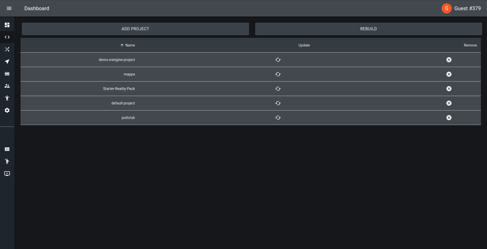

# Projects

Projects are folders that contain all your custom code, assets and scenes. They
are version controlled using git & github, and can be installed to any deployment
with a single click. (more on that in the [next chapter](./02-editor-scenes-locations.md))

Pictured below is an example of 4 projects installed. By default, only the 
`default-project` is installed, which in a production environment is read only.
You can find the default project under `/packages/projects/default-project/`

In a production environment, the builder process will install all projects
according to the `project` database table and will download files from the
storage provider. In a local development environment, the local file system is
always the source of truth. Any project folders added or removed from the file
system will be automatically added or removed from the database. This is to
ensure there is no accidental loss of data, as these project folders are all git
repositories.


## Configuration

Projects have a few conventions.

- `assets/` is where files uploaded from the editor will be uploaded to

- `public/` is for hosting public assets, these will be served from the client

- `sceneName.scene.json` is a scene file

- `sceneName.thumbnail.png` is an auto-generated scene thumbnail file

- `xrengine.config.ts` the project configuration, where client routes, database 
  models, feathers services and the project thumbnail can be defined

A project can also have a package.json to provide custom dependencies.
`@xrengine/*` monorepo dependencies will be symlinked and not needed, but some
package managers (such as pnpm) require these to be defined. If so, they should
be defined in `peerDependencies`.

## Local Install Flow

To install a project locally, clone the repository you wish to install to the 
`/packages/projects/projects/` folder. You can do this with the follow commands:

```
cd packages/projects/projects/
git clone https://github.com/myorg/myrepo
cd myrepo 
code .
```

This will create a folder name `myrepo` which must contain an `xrengine.config.ts`
file, and open the project in a new vscode window (such that git commands can be 
handled by the new window). All you need to do now to run this project is re-run
the stack (with `npm run dev`).

## Graphical Install Flow

Projects can also be installed and managed from the /admin/projects route. Click
the 'Add Project' 




In local development, the 'Remove Project' button has been disabled, as to
ensure no accidental loss of data.

This runs `git clone` in the background, same as above, but will then upload all
of the repository's files to the storage provider. These files will then be 
downloaded and installed to the local file system each time the docker builder 
pod runs. This allows full version controlled access for local development flow
and version locking for production deployment.

The update button will re-download the git repository to install the latest 
version of the project.

The remove button will remove the folder containing that project. WARNING: Any 
uncommitted & unpushed files will be lost.

## Config

The xrengine config file has the following options:

```ts
export interface ProjectConfigInterface {
  onEvent?: string
  thumbnail?: string
  routes?: {
    [route: string]: {
      component: () => Promise<{ default: (props: any) => JSX.Element }>
      props?: {
        [x: string]: any
        exact?: boolean
      }
    }
  }
  webappInjection?: () => Promise<{ default: (props: any) => void | JSX.Element }>
  worldInjection?: () => Promise<{ default: (world: World) => Promise<void> }>
  services?: string
  databaseSeed?: string
  settings?: Array<ProjectSettingSchema>
}
```

### Hooks
The `onEvent` property is a relative path string that points to a file which 
must expose an object with properties as follows:

```ts
export interface ProjectEventHooks {
  onInstall?: (app: Application) => Promise<any>
  onUpdate?: (app: Application) => Promise<any>
  onUninstall?: (app: Application) => Promise<any>
}
```

These functions are called when the project they belong to are installed, 
updated (such as scenes saved) or uninstalled respectively. This is used in the 
default xrengine project to install the default avatars. 
See `/packages/projects/default-project/projectEventHooks.ts`.

### Thumbnail

This is a URL to a thumbnail for the project.

### Routes

Routes enable users to customise the various URL paths of their website 
utilising dynamic loading of modules. The key of each object represents the path 
(with leading forward slash included) while the value represents a react 
component object which gets wrapped in `React.lazy()` and a props object which 
passes options into the react-dom-router Route component corresponding to the route.

### Webapp Injection
Webapp injection allows logic to be run on all pages, loaded before any routes 
are loaded. This will soon be extended to allow easy stylesheet injection and 
other configurables of the webapp.

### World Injection

World injection allows logic to be run every time a new world is created, 
currently only when the engine is initialised. This is loaded on all instances 
of the engine, such as a location and the editor. An example use case of this 
would be registering custom scene loader and editor prefabs.

### Services

The `services` property is a relative path that points to a file which must 
return type `((app: Application) => Promise<any>)[]` which is run on all 
gameservers and api servers at startup. This allows users to expose custom 
Feathers services, or whatever other functionality they made need.

### Database Seeding

The `databaseSeed` property is a relative path that points to a file which must 
return type `ServicesSeedConfig` from `../packages/common/src/interfaces/ServicesSeedConfig.ts`
which is run when the database seeder is run. This can be useful for setting 
custom locations, which can be seen in the 
[xrengine demo project](https://github.com/XRFoundation/demo-xrengine-project).
