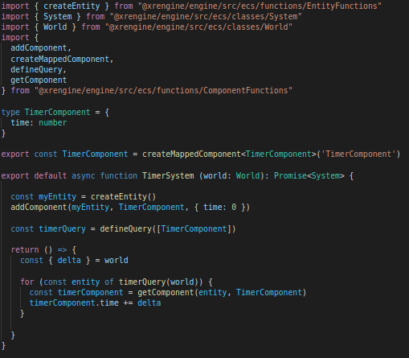

## What is an ECS?

ECS stands for Entity Component System. It is a pattern for organising data and objects that allows for composition over inheritance. An entity is simply a number that points to a particular set of data contained in components. Systems then operate logic on these entities and components.

Some references
- [Entity Component System Overview in 7 Minutes](https://www.youtube.com/watch?v=2rW7ALyHaas)
- [Entity Component System in TypeScript with Phaser 3 and bitECS)](https://www.youtube.com/watch?v=qaY_CKvFLYM)
- [Overwatch GDC ECS & Netcode](https://www.youtube.com/watch?v=W3aieHjyNvw) (note, xrengine does not use this style of network)

### Example



This code creates a TimerComponent, creates a new entity and adds the component to it, creates a system that will then add the world delta for the current frame each update.

## Update Loop

The engine uses a very similar model to Unity's update loop (found here https://docs.unity3d.com/Manual/ExecutionOrder.html). It has a frame update, called once per frame, of which inside is a fixed update, which operates on an accumulator system. This system ensures a stable number of updates per second independent of the framerate. This means it may have 0 to many updates in a given frame. 

## XREngine ECS API

### The World

..

### Systems

..

### API

[Component Functions](../packages/engine/src/ecs/functions/ComponentFunctions.ts)

#### Entities

`createEntity`

`removeEntity`

#### Component Lifecycle

`createMappedComponent`

`addComponent`

`hasComponent`

`getComponent`

`removeComponent`

#### Queries

`defineQuery`

`enter queries`

`exit queries`


### Examples

#### Tag Components

Tag components are how booleans are represented in the ECS pattern. An entity either has a specific tag component, or it doesn't. The SceneObjectSystem includes queries for Object3DComponent and VisibleComponent. Any entities with an Object3DComponent that has a VisibleComponent added, will have the 'visible' property of the Object3D referenced in Object3DComponent.value set to 'true', and set to 'false' when the VisibleComponent is removed.


```ts

const visibleEntity = createEntity()

const obj3d = new Object3D()
obj3d.visible = false // since threejs defaults .visible to true, we must set it manually to sync up with the ECS

addComponent(entity, Object3D, { value: obj3d })

console.log(obj3d.visible) // false

addComponent(entity, VisibleComponent)

// iterate logic loop

console.log(obj3d.visible) // true

removeComponent(entity, VisibleComponent)

// iterate logic loop

console.log(obj3d.visible) // false

```